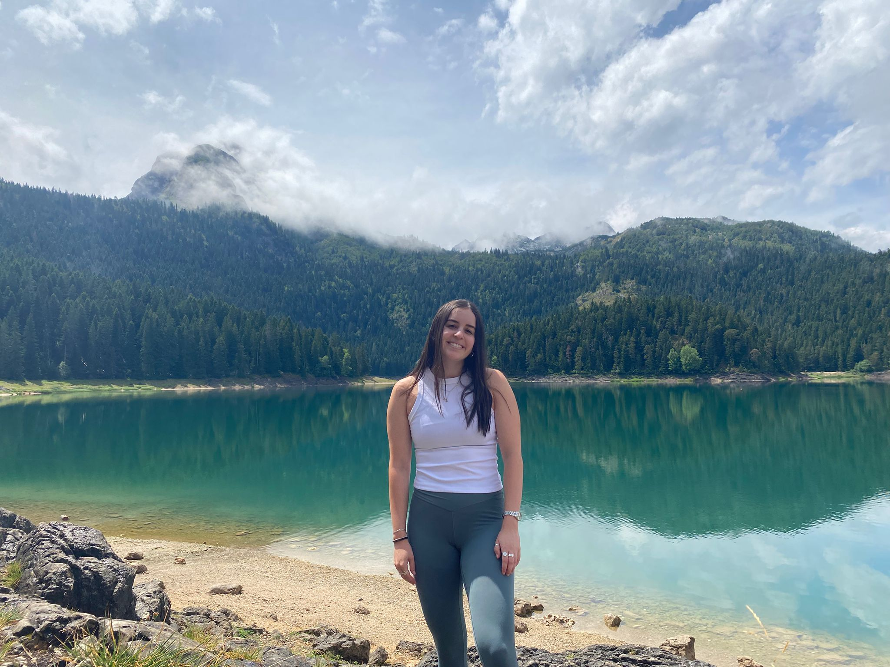

# Welcome everyone!

My name is [Daniela Huppert](https://weizmann.elsevierpure.com/en/persons/daniela-huppert-revach/)
---
I'm a **Master's student** at the **weizmann institute of science**.

I'm currently doing my rotation in **[Prof. Reiner's lab](https://www.weizmann.ac.il/molgen/Reiner/)**, where we study Brain development in Health and Disease.

---
## My project
Deciphering CUL4B protein interactions during specific stages of the cell cycle.

